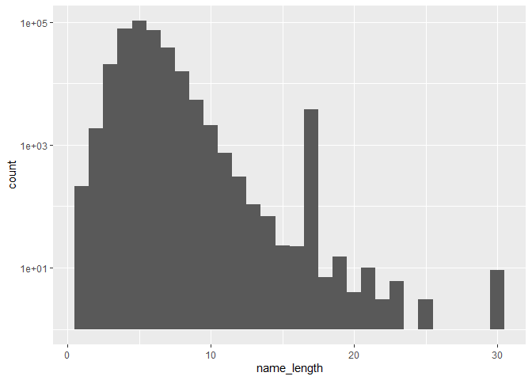

```r
library(tidyverse)
library(dplyr)
library(ggplot2)
```


```r
dogs <- read.csv("NYC_Dog_Licensing_Dataset.csv")
```

Get a feel for the data set

```r
glimpse(dogs)
```

```
## Rows: 345,727
## Columns: 10
## $ RowNumber          <int> 1, 2, 3, 4, 5, 6, 7, 8, 9, 10, 11, 12, 13, 14, 1...
## $ AnimalName         <chr> "PAIGE", "YOGI", "ALI", "QUEEN", "LOLA", "IAN", ...
## $ AnimalGender       <chr> "F", "M", "M", "F", "F", "M", "M", "F", "F", "M"...
## $ AnimalBirthMonth   <int> 2014, 2010, 2014, 2013, 2009, 2006, 2008, 2012, ...
## $ BreedName          <chr> "American Pit Bull Mix / Pit Bull Mix", "Boxer",...
## $ Borough            <lgl> NA, NA, NA, NA, NA, NA, NA, NA, NA, NA, NA, NA, ...
## $ ZipCode            <int> 10035, 10465, 10013, 10013, 10028, 10013, 10025,...
## $ LicenseIssuedDate  <chr> "09/12/2014", "09/12/2014", "09/12/2014", "09/12...
## $ LicenseExpiredDate <chr> "09/12/2017", "10/02/2017", "09/12/2019", "09/12...
## $ Extract.Year       <int> 2016, 2016, 2016, 2016, 2016, 2016, 2016, 2016, ...
```

Most pouplar breed?


```r
dogs %>%
  count(BreedName, sort=TRUE) %>%
  head()
```

```
##            BreedName     n
## 1            Unknown 38785
## 2  Yorkshire Terrier 21922
## 3           Shih Tzu 19631
## 4          Chihuahua 15647
## 5            Maltese 11391
## 6 Labrador Retriever 11327
```

Longest animal names?

```r
long_names <- dogs %>%
  mutate(name_length = nchar(AnimalName)) %>%
  filter(name_length>20) %>%
  select(AnimalName, name_length)
long_names
```

```
##                        AnimalName name_length
## 1         2008-10-22T00:00:00.000          23
## 2         2004-10-22T00:00:00.000          23
## 3         2003-10-22T00:00:00.000          23
## 4           DANGERFIELDS-MR.BOBBY          21
## 5  CARLYAPPLEWHITECRAWFORDCOLEMAN          30
## 6  SAMSONMAXWELLWALTERZANE(SAMMY)          30
## 7         2005-08-19T00:00:00.000          23
## 8         2003-08-13T00:00:00.000          23
## 9         2003-08-13T00:00:00.000          23
## 10         SHAWN-MICHAEL-VINCIENT          22
## 11 JEFFERSONBARNARDRAMSEYDONNELLY          30
## 12      BUDDYVONYANKEEDESHORTHAIR          25
## 13          EUNICETHOMPSON-STROUD          21
## 14 PIPLONGFELLOWBUTTERFIELDFROUDE          30
## 15          PANDORA MARIE COLLIER          21
## 16          FLYNN-(BILLYGSWANNBE)          21
## 17 JEFFERSONBARNARDRAMSEYDONNELLY          30
## 18          FLYNN-(BILLYGSWANNBE)          21
## 19      BUDDYVONYANKEEDESHORTHAIR          25
## 20          EUNICETHOMPSON-STROUD          21
## 21 PIPLONGFELLOWBUTTERFIELDFROUDE          30
## 22          PANDORA MARIE COLLIER          21
## 23 BUDEREAUXBUDERONIMUSBUDEROWSKI          30
## 24         SHAWN-MICHAEL-VINCIENT          22
## 25          FLYNN-(BILLYGSWANNBE)          21
## 26          EUNICETHOMPSON-STROUD          21
## 27 PIPLONGFELLOWBUTTERFIELDFROUDE          30
## 28 BUDEREAUXBUDERONIMUSBUDEROWSKI          30
## 29         SHAWN-MICHAEL-VINCIENT          22
## 30      BUDDYVONYANKEEDESHORTHAIR          25
## 31          PANDORA MARIE COLLIER          21
```


```r
dogs %>%
  mutate(name_length=nchar(AnimalName))%>%
  ggplot(aes(x=name_length))+
  geom_histogram()+
  scale_y_log10()
```

```
## `stat_bin()` using `bins = 30`. Pick better value with `binwidth`.
```

```
## Warning: Removed 444 rows containing non-finite values (stat_bin).
```

```
## Warning: Transformation introduced infinite values in continuous y-axis
```

```
## Warning: Removed 5 rows containing missing values (geom_bar).
```

<!-- -->


```r
long_names %>%
  filter(name_length>29)
```

```
##                       AnimalName name_length
## 1 CARLYAPPLEWHITECRAWFORDCOLEMAN          30
## 2 SAMSONMAXWELLWALTERZANE(SAMMY)          30
## 3 JEFFERSONBARNARDRAMSEYDONNELLY          30
## 4 PIPLONGFELLOWBUTTERFIELDFROUDE          30
## 5 JEFFERSONBARNARDRAMSEYDONNELLY          30
## 6 PIPLONGFELLOWBUTTERFIELDFROUDE          30
## 7 BUDEREAUXBUDERONIMUSBUDEROWSKI          30
## 8 PIPLONGFELLOWBUTTERFIELDFROUDE          30
## 9 BUDEREAUXBUDERONIMUSBUDEROWSKI          30
```

Most common names?


```r
dogs %>%
  count(AnimalName,sort=TRUE) %>%
  filter(n>1500) %>%
  filter(AnimalName != "UNKNOWN") %>%
  filter(AnimalName != "NAME NOT PROVIDED")
```

```
##    AnimalName    n
## 1       BELLA 3824
## 2         MAX 3582
## 3     CHARLIE 2852
## 4        COCO 2636
## 5        LOLA 2470
## 6       ROCKY 2414
## 7        LUCY 2149
## 8       BUDDY 2011
## 9        LUNA 1974
## 10      LUCKY 1950
## 11      DAISY 1890
## 12      TEDDY 1720
## 13     BAILEY 1705
## 14   PRINCESS 1640
## 15       TOBY 1509
```

Are there any dogs named "CAT"?

```r
dogs %>%
  select(AnimalName,AnimalGender, AnimalBirthMonth,BreedName) %>%
  filter(AnimalName=="CAT")
```

```
##    AnimalName AnimalGender AnimalBirthMonth                     BreedName
## 1         CAT            F             2015 Labrador Retriever Crossbreed
## 2         CAT            F             2011                       Unknown
## 3         CAT            F             2014                     Chihuahua
## 4         CAT            F             2011                       Unknown
## 5         CAT            F             2011                       Unknown
## 6         CAT            F             2017                French Bulldog
## 7         CAT            F             2014                     Chihuahua
## 8         CAT            F             2011                       Unknown
## 9         CAT            F             2011                       Unknown
## 10        CAT            F             2017                French Bulldog
## 11        CAT            F             2015                     Chihuahua
## 12        CAT            F             2014                     Chihuahua
## 13        CAT            F             2011                       Unknown
```
Are there any dogs named "KITTY"?

```r
dogs %>%
  select(AnimalName,AnimalGender, AnimalBirthMonth,BreedName) %>%
  filter(AnimalName=="KITTY")
```

```
##    AnimalName AnimalGender AnimalBirthMonth
## 1       KITTY            F             2003
## 2       KITTY            F             2006
## 3       KITTY            M             2003
## 4       KITTY            F             2010
## 5       KITTY            F             2015
## 6       KITTY            F             2005
## 7       KITTY            F             2014
## 8       KITTY            F             2014
## 9       KITTY            F             2012
## 10      KITTY            F             2009
## 11      KITTY            F             2010
## 12      KITTY            F             2012
## 13      KITTY            F             2010
## 14      KITTY            F             2010
## 15      KITTY            F             2005
## 16      KITTY            F             2015
## 17      KITTY            F             2004
## 18      KITTY            F             2010
## 19      KITTY            F             2012
## 20      KITTY            F             2004
## 21      KITTY            F             2014
## 22      KITTY            F             2014
## 23      KITTY            F             2010
## 24      KITTY            F             2005
## 25      KITTY            F             2015
## 26      KITTY            F             2012
## 27      KITTY            F             2009
## 28      KITTY            F             2010
## 29      KITTY            F             2005
## 30      KITTY            F             2010
## 31      KITTY            F             2012
## 32      KITTY            F             2012
## 33      KITTY            F             2004
## 34      KITTY            F             2010
## 35      KITTY            F             2004
## 36      KITTY            F             2014
## 37      KITTY            F             2015
## 38      KITTY            F             2009
## 39      KITTY            F             2010
## 40      KITTY            F             2005
## 41      KITTY            F             2004
## 42      KITTY            F             2014
## 43      KITTY            F             2005
## 44      KITTY            F             2010
## 45      KITTY            F             2012
## 46      KITTY            F             2014
## 47      KITTY            F             2012
## 48      KITTY            F             2010
## 49      KITTY            F             2011
## 50      KITTY            F             2004
## 51      KITTY            M             2018
## 52      KITTY            F             2010
##                               BreedName
## 1                               Maltese
## 2                             Pekingese
## 3                  Chihuahua Crossbreed
## 4  American Pit Bull Mix / Pit Bull Mix
## 5               Black and Tan Coonhound
## 6           Pointer, German Shorthaired
## 7                             Chihuahua
## 8                         Border Collie
## 9                           Terrier mix
## 10                        Cairn Terrier
## 11                     Poodle, Standard
## 12                             Shih Tzu
## 13                               Poodle
## 14                            Chihuahua
## 15                              Maltese
## 16                        Border Collie
## 17                             Havanese
## 18           German Shepherd Crossbreed
## 19                            Chihuahua
## 20                                  Pug
## 21                            Chihuahua
## 22                        Border Collie
## 23                               Poodle
## 24                              Maltese
## 25                        Border Collie
## 26                            Chihuahua
## 27                        Cairn Terrier
## 28                     Poodle, Standard
## 29          Pointer, German Shorthaired
## 30                            Chihuahua
## 31                             Shih Tzu
## 32                          Terrier mix
## 33                             Havanese
## 34           German Shepherd Crossbreed
## 35                                  Pug
## 36                            Chihuahua
## 37                        Border Collie
## 38                        Cairn Terrier
## 39                     Poodle, Standard
## 40          Pointer, German Shorthaired
## 41                                  Pug
## 42                        Border Collie
## 43                              Maltese
## 44                  Miniature Schnauzer
## 45                          Terrier mix
## 46                            Chihuahua
## 47                             Shih Tzu
## 48                            Chihuahua
## 49                                  Pug
## 50                             Havanese
## 51            Siberian Husky Crossbreed
## 52           German Shepherd Crossbreed
```

```r
dogs %>%
  select(AnimalName,AnimalGender, AnimalBirthMonth,BreedName) %>%
  filter(AnimalName=="KITTEN")
```

```
##   AnimalName AnimalGender AnimalBirthMonth BreedName
## 1     KITTEN            M             2012   Unknown
```

